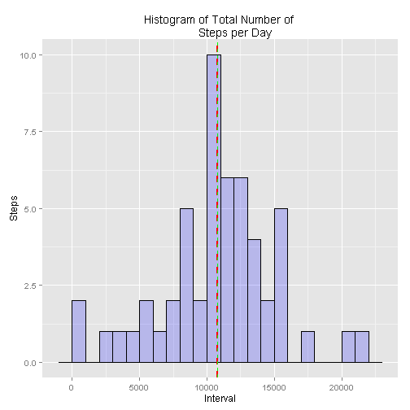
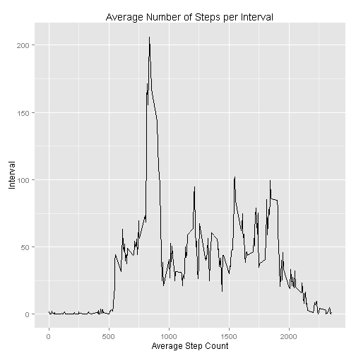
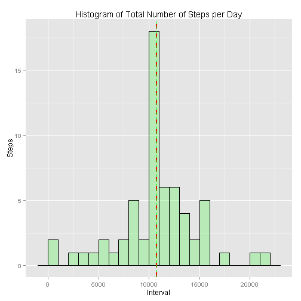
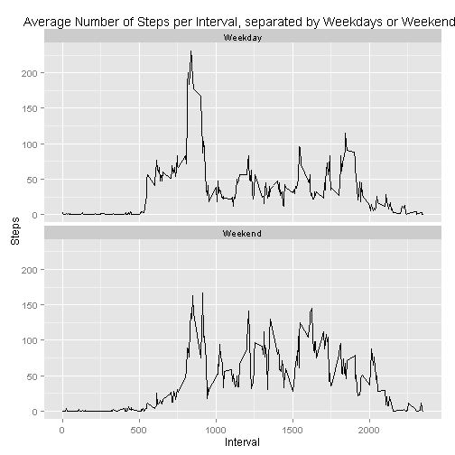

#Reproducible Research - Assignment 1#
##Packages and Data##

This code is dependent upon the plyr, dplyr and ggplot2
packages.

The data for this assignment "of two months of data from an anonymous individual collected during the months of October and November, 2012 and include the number of steps taken in 5* minute intervals each day." - [course website](https://class.coursera.org/repdata-033/human_grading/view/courses/975146/assessments/3/submissions)

*Note:After a bit of math, I believe the intervals are approximately 3 minutes long, not 5.*

The data can be downloaded [here](https://d396qusza40orc.cloudfront.net/repdata%2Fdata%2Factivity.zip) and unzipped into your working directory.


```r
activity <- read.csv("activity.csv")
```

##What is mean total number of steps taken per day?##

###Calculate the total number of steps taken per day###

I used the aggregate function to split the data into subsets by date, then applying the "sum" function to each subset.

```r
dateSum <- aggregate(steps ~ date, FUN=sum, data=activity, na.action = "na.omit")
```

###Make a histogram of the total number of steps taken each day###

I used ggplot to do a basic histogram with some fancy colors. I included two dashed lines placed on the median and the mean of the histgram

```r
ggplot(data=dateSum, aes(dateSum$steps)) + 
  geom_histogram( binwidth = 1000,
                 col="black", 
                 fill="blue", 
                 alpha = .2) + 
    labs(title="Histogram of Total Number of 
         Steps per Day") +
    labs(x="Interval", y="Steps") +
  #Mean line
    geom_vline(aes(xintercept=mean(steps)),   
           color="red", linetype="dashed", size=1)+
  #Median line
    geom_vline(aes(xintercept=median(steps)), color = "green", linetype="dashed", size = .5)
```

 

###Calculate and report the mean and median of the total number of steps taken per day###


```r
stepmean <- mean(dateSum$steps, na.rm = TRUE) #mean 
stepmedian <- median(dateSum$steps, na.rm = TRUE) #median
cat("Mean of total number of steps: ", stepmean)
```

```
## Mean of total number of steps:  10766.19
```

```r
cat("Median of total number of steps: ", stepmedian)
```

```
## Median of total number of steps:  10765
```

##What is the average daily activity pattern?##

###Make a time series plot of the 5-minute interval (x-axis) and the average number of steps taken, averaged across all days (y-axis)###

This was likely not the most efficient way of accomplishing this, but it works! intnarm variable stores all the rows without an NA. Then I grouped the intrmna data by interval, then mutated a column that takes the mean of each subgroup.  I then stored in linedata one of each interval.


```r
#take out all the rows with NAs in the steps column
intnarm <- filter(activity, !is.na(steps))

#group the data by interval ID
groupint <- group_by(intnarm, interval)

#make a column averaging the number of steps vs interval ID
intervalavg <- mutate(groupint, intavg = mean(steps))

#make a dataframe consisting only of distinct interval ID/intavg rows
linedata <- distinct(intervalavg, interval)
```

Now another fancy ggplot graph, featuring a line type graph.

```r
ggplot(data=linedata, aes(x=interval, y=intavg, group=date)) +
  geom_line() +
  labs(title="Average Number of Steps per Interval") +
  labs(x="Average Step Count", y="Interval")  +
  geom_line(color="black") 
```

 
  
###Which 5-minute interval, on average across all the days in the dataset, contains the maximum number of steps?###

Simple use of the max() function to find the maximum mean value.


```r
maxintavg <- max(linedata$intavg)
maxintrow <- which(linedata$intavg == maxintavg)
maxint<- as.vector(unlist(linedata[maxintrow,3]))
cat("Interval with maximum average: ", maxint)
```

```
## Interval with maximum average:  835
```

###Conclusions###
Since the Interval with maximum average is 835, and each interval is approximatly 3 minutes, we can conclude that the highest amount of steps is likely to occur around 8:30 am.

##Imputing missing values##
###Calculate and report the total number of missing values in the dataset (i.e. the total number of rows with NAs)###

I ran rowSums() which essentially "marked" each row with an NA with a "1".  Then I ran sum() on that column and got my final number!


```r
narows <- rowSums(is.na(activity)) 
narowtotal <- sum(narows)
cat("Total number of rows containing an NA: ", narowtotal)
```

```
## Total number of rows containing an NA:  2304
```

###Devise a strategy for filling in all of the missing values in the dataset###

First I stored the raw data in a test variable, just in case.  Easier than re-reading the .csv everytime something messed up.

```r
testact <- activity #copy raw data, just in case
```
The following chuck was inspired by Leonard Greski in the discussion forums:

I aggregate()'d data by grouping steps by interval, run a mean function on each group while omitting NAs. Renamed the new column "intervalMean". Then created a new dataset that is equal to the original dataset but with means to replace the missing data.

```r
aggAct <- aggregate(steps ~ interval, FUN=mean,data=testact,na.action="na.omit")

names(aggAct)[2] <- "intervalMean"

mergedAct <- merge(testact,aggAct) 

#This is some magic right here.  Took me some playing to really grok it.
#This assigns the value of the intervalMean column that is found in a
#specific steps row to the specific steps column in the original data
mergedAct$steps[is.na(mergedAct$steps)] <-  
  mergedAct$intervalMean[is.na(mergedAct$steps)]

corrDateSum <- aggregate(steps ~ date, FUN=sum, data=mergedAct)
```
###Make a histogram of the total number of steps taken each day###
More ggplot to the rescue! Again marked the mean and median within the histogram.


```r
ggplot(data=corrDateSum, aes(corrDateSum$steps)) + 
  geom_histogram( binwidth = 1000,
                  col="black", 
                  fill="green", 
                  alpha = .2) + 
  labs(title="Histogram of Total Number of Steps per Day") +
  labs(x="Interval", y="Steps") +
 #Mean line
    geom_vline(aes(xintercept=mean(steps)),   
           color="red", linetype="dashed", size=1)+
  #Median line
    geom_vline(aes(xintercept=median(steps)), color="green", linetype="dashed", size = .5)
```

 

###Calculate and report the mean and median total number of steps taken per day###

```r
corrStepMean <- mean(corrDateSum$steps, na.rm = TRUE) #mean 
corrStepMedian <- median(corrDateSum$steps, na.rm = TRUE) #median
cat("The corrected mean of total steps: ", corrStepMean)
```

```
## The corrected mean of total steps:  10766.19
```

```r
cat("The corrected median of total steps: ", corrStepMedian)
```

```
## The corrected median of total steps:  10766.19
```
##Are there differences in activity patterns between weekdays and weekends?##
###Create a new factor variable in the dataset with two levels -- "weekday" and "weekend"###

We have here a nice for loop that assigns Weekend or Weekday labels with help from the weekday() function.
We then insert that vector into the mergedAct data frame and name the columns.  I did borrow heavily from another programmer for this part, and unfortunately I forgot to record the URL. 

```r
day <- weekdays(as.Date(mergedAct$date, "%m/%d/%Y"))
daylevel <- vector()
for (i in 1:nrow(mergedAct)) {
  if (day[i] == "Saturday") {
    daylevel[i] <- "Weekend"
  } else if (day[i] == "Sunday") {
    daylevel[i] <- "Weekend"
  } else {
    daylevel[i] <- "Weekday"
  }
}
mergedAct$daylevel <- daylevel
mergedAct$daylevel <- factor(mergedAct$daylevel)

stepsByDay <- aggregate(steps ~ interval + daylevel, data = mergedAct, mean)
names(stepsByDay) <- c("interval", "daylevel", "steps")
```
###Make a panel plot containing a time series plot (i.e. type = "l") of the 5-minute interval (x-axis) and the average number of steps taken, averaged across all weekday days or weekend days (y-axis).###

Panel plot, coming your way!

```r
ggplot(data=stepsByDay, aes(x=interval, y=steps, group=daylevel)) +
 geom_line() +
 facet_wrap(~daylevel, ncol=1)+
 ylab("Steps")+
  xlab("Interval")+
  ggtitle("Average Number of Steps per Interval, separated by Weekdays or Weekends")
```

 

##Conclusions##
We can see from the plots that step activity does change from weekday to weekend.  Weekend activity seems to be more consistent throughout the day with medium peaks at many intervals, where weekday activity seems limited to one major peak near the beginning of each day with a minor peak in the evening.


